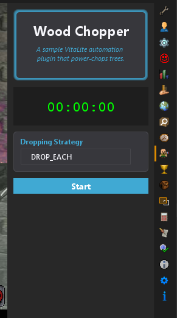

# VitaLite Example Plugin
This is an example automation plugin for VitaLite showcasing how to create a plugin that interacts with the game, usage of VitaLites APIs, and project/gradle structure.

## Info
The sample plugin here is a simple power-chopper.

